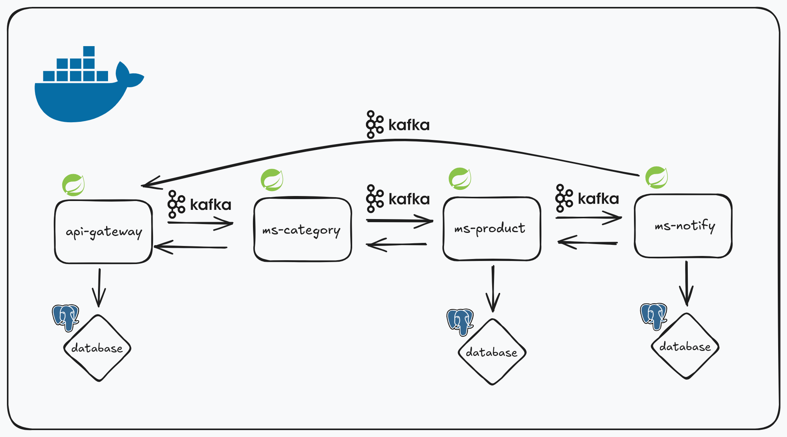

#### ABOUT
This is a simple distributed application, for study more about choreography based saga, Spring Boot and Kafka.

#### ARCHITETURE

#### INSTALL

- first you need to clone this repository in your machine, before make sure you have the git
installed, then you run `git clone https://github.com/nothiaki/warehouse.git`;
- go to the project directory using `cd warehouse`;
- before go to the next step make sure you have [docker](https://www.docker.com/) and
[docker compose](https://docs.docker.com/compose/) installed;
- and just run `docker compose up -build` or with you are in linux run `sudo docker compose up -build`

#### DOCS

api-gateway running on 8080 [docs](api-gateway/DOCS.md) 
ms-product running on 8090 [docs](ms-product/DOCS.md) 
ms-category running on 8091 [docs](ms-category/DOCS.md)
ms-notify running on 8092 [docs](ms-notify/DOCS.md)

kafka running on INTERNAL: 29092, EXTERNAL: 9092 
postgres-ms-product running on 5432 
postgres-ms-notify running on 5433 
postgres-api-gateway running on 5434 
